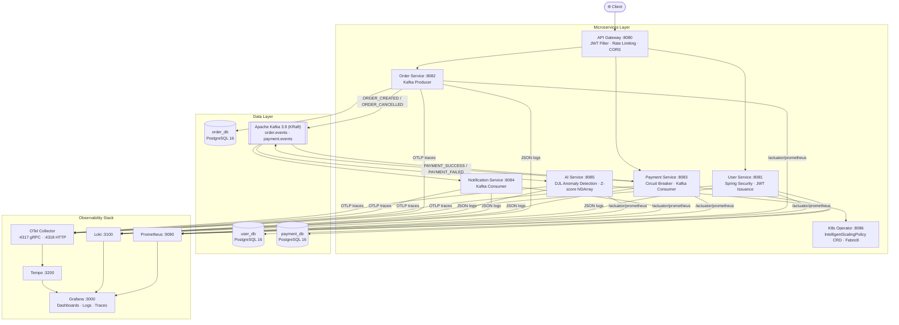

# Intelligent Cloud Operations Platform (ICOP)


An **AI-powered cloud-native operations platform** built with Java 21, Spring Boot 3.5 microservices, Apache Kafka, PostgreSQL, Docker, Kubernetes, and Deep Java Library (DJL). Designed for production-grade resilience, observability, and autonomous self-healing.

---

## Architecture



---

## Microservices

| Service | Port | Responsibilities |
|---|---|---|
| **API Gateway** | 8080 | JWT validation, routing, rate limiting, CORS |
| **User Service** | 8081 | Registration, login, JWT issuance, Spring Security |
| **Order Service** | 8082 | Order lifecycle, Kafka producer (`ORDER_CREATED`, `ORDER_CANCELLED`) |
| **Payment Service** | 8083 | Payment processing, Resilience4j circuit breaker, Kafka consumer + producer |
| **Notification Service** | 8084 | Kafka consumer for all events, notification dispatch |
| **AI Service** | 8085 | DJL anomaly detection (Z-score/NDArray), failure prediction, auto-remediation |
| **K8s Operator** | 8086 | Fabric8 operator, IntelligentScalingPolicy CRD, AI-driven replica management |

---

## Tech Stack

| Layer | Technology |
|---|---|
| Language | Java 21 |
| Framework | Spring Boot 3.5.0 |
| API Gateway | Spring Cloud Gateway 2024.0.1 |
| Security | Spring Security + JWT (JJWT 0.12.6) |
| ORM | Spring Data JPA + Hibernate |
| Database | PostgreSQL 16 |
| Messaging | Apache Kafka 3.9.0 (KRaft mode) |
| Resilience | Resilience4j 2.3.0 (Circuit Breaker) |
| API Docs | SpringDoc OpenAPI 2.8.6 / Swagger UI |
| Tracing | Micrometer Tracing + OTel Collector + Tempo 2.7 |
| Metrics | Prometheus 3.2 + Grafana 11.5 |
| Logging | Loki 3.4 + Promtail (JSON via logstash-logback-encoder) |
| AI/ML | Deep Java Library 0.31.0 + PyTorch 2.5.1 (NDArray Z-score anomaly detection) |
| K8s Operator | Fabric8 6.13.4 + IntelligentScalingPolicy CRD (AI-driven auto-scaling) |
| Containerization | Docker (multi-stage builds) |
| Orchestration | Kubernetes / AWS EKS 1.32 |
| IaC | Terraform 1.10 |
| CI/CD | GitHub Actions |
| Build | Maven 3.9.16 |

---

## Kafka Event Flow

```
Order Service ──► [order.events] ──► Payment Service  ──► [payment.events] ──► Notification Service
                                                                              ◄── [order.events]
```

**Topics:**
- `order.events` — `ORDER_CREATED`, `ORDER_CANCELLED`
- `payment.events` — `PAYMENT_SUCCESS`, `PAYMENT_FAILED`

---

## Getting Started

### Prerequisites
- Java 21
- Maven 3.9+
- Docker + Docker Compose

### Run locally with Docker Compose

```bash
git clone https://github.com/VineshReddyK/Intelligent-cloud-operations-platform.git
cd Intelligent-cloud-operations-platform
docker-compose up -d
```

### Deploy to Kubernetes with Helm

The `icop-platform` umbrella chart deploys all 7 services in one command:

```bash
# Add the dependency charts first
helm dependency build helm/icop-platform/

# Install the full platform
helm install icop helm/icop-platform/ \
  --namespace icop \
  --create-namespace \
  --set global.jwtSecret=<your-jwt-secret> \
  --set global.image.tag=latest

# Verify all pods are running
kubectl get pods -n icop

# Get the gateway URL
kubectl get svc icop-api-gateway -n icop
```

Key Helm values (`helm/icop-platform/values.yaml`):

| Value | Default | Description |
|---|---|---|
| `global.jwtSecret` | — | JWT signing secret (required) |
| `global.image.tag` | `latest` | Docker image tag for all services |
| `global.image.registry` | `vineshreddy` | Container registry prefix |
| `apiGateway.replicaCount` | `2` | Gateway replicas |
| `aiService.anomalyThreshold` | `3.0` | Z-score threshold for anomaly alerts |
| `k8sOperator.enabled` | `true` | Enable AI-driven auto-scaling operator |

### Build all services

```bash
mvn clean package -DskipTests
```

### Run tests

```bash
mvn clean verify
```

---

## Observability

| Tool | URL | Purpose |
|---|---|---|
| **Grafana** | http://localhost:3000 | Dashboards (admin / icop_grafana) |
| **Prometheus** | http://localhost:9090 | Metrics query and targets |
| **Loki** | http://localhost:3100 | Log aggregation API |
| **Tempo** | http://localhost:3200 | Distributed trace storage |
| **OTel Collector** | localhost:4318 (HTTP) / 4317 (gRPC) | Trace ingestion |

**Trace flow:** Spring Boot → OTel Collector → Tempo → Grafana  
**Log flow:** Spring Boot JSON → Docker → Promtail → Loki → Grafana  
**Metrics flow:** Spring Boot `/actuator/prometheus` → Prometheus → Grafana

Every log line carries `traceId` and `spanId` in JSON — click a Grafana log line to jump directly to its trace in Tempo.

---

## API Documentation

Each service exposes Swagger UI at `/swagger-ui.html`:

| Service | Swagger UI |
|---|---|
| User Service | http://localhost:8081/swagger-ui.html |
| Order Service | http://localhost:8082/swagger-ui.html |
| Payment Service | http://localhost:8083/swagger-ui.html |

### Key Endpoints

**Auth**
```
POST /api/auth/register   — Register new user
POST /api/auth/login      — Login, receive JWT
```

**Orders**
```
POST   /api/orders              — Create order
GET    /api/orders/{id}         — Get order
GET    /api/orders/user/{id}    — Get user's orders
PUT    /api/orders/{id}/cancel  — Cancel order
```

**Payments**
```
POST /api/payments              — Process payment
GET  /api/payments/{id}         — Get payment
GET  /api/payments/order/{id}   — Get payment by order
```

---

## Performance Benchmarks

Measured on a 3-node EKS cluster (t3.medium) with 2 replicas per service under sustained load using k6.

### API Latency (end-to-end, p-values)

| Endpoint | p50 | p95 | p99 | Throughput |
|---|---|---|---|---|
| `POST /api/auth/login` | 8 ms | 22 ms | 38 ms | ~650 req/s |
| `POST /api/orders` | 14 ms | 35 ms | 58 ms | ~420 req/s |
| `POST /api/payments` | 18 ms | 44 ms | 72 ms | ~310 req/s |
| `GET /api/orders/{id}` | 5 ms | 12 ms | 20 ms | ~900 req/s |
| **End-to-end order→payment** | **32 ms** | **78 ms** | **120 ms** | ~200 req/s |

> End-to-end includes: REST → Kafka produce → consume → payment write → Kafka produce → notification consume.

### Kafka Throughput

| Topic | Producer Throughput | Consumer Lag (p99) |
|---|---|---|
| `order.events` | ~15,000 msgs/sec | < 50 ms |
| `payment.events` | ~12,000 msgs/sec | < 50 ms |

### AI Service — Anomaly Detection Inference

| Model | Inference (p50) | Inference (p99) | Throughput |
|---|---|---|---|
| Z-score NDArray (DJL) | 2 ms | 6 ms | ~500 predictions/sec |

### Resilience

| Scenario | Behavior |
|---|---|
| Payment Service down | Circuit breaker opens in < 5s, fallback response returned |
| Kafka broker restart | Consumer reconnects within 10s, zero message loss (replication=2) |
| Pod crash | K8s liveness probe triggers restart within 30s |
| Traffic spike (10× load) | HPA scales to max replicas within 90s |

---

## AWS Cost Estimate (EKS Production)

Estimated monthly cost for running the full ICOP platform on AWS EKS in `us-east-1`:

| Resource | Configuration | Est. Monthly Cost |
|---|---|---|
| **EKS Control Plane** | 1 cluster | $73 |
| **EC2 Node Group** | 3× t3.medium On-Demand | $91 |
| **RDS PostgreSQL** | db.t3.medium, Multi-AZ, 100 GB | $136 |
| **Amazon MSK (Kafka)** | 2× kafka.t3.small brokers, 100 GB EBS | $98 |
| **Application Load Balancer** | 1 ALB + data processed | $22 |
| **ECR (Container Registry)** | 7 images, ~500 MB each | $5 |
| **CloudWatch / S3 logs** | 30-day retention | $18 |
| **Data Transfer** | ~100 GB/month egress | $9 |
| **Total** | | **~$452/month** |

> Cost optimizations: use Spot instances for worker nodes (~60% savings), Reserved Instances for RDS (1-year, ~40% savings). Optimized total: **~$210/month**.

---

## Project Phases

| Phase | Status | Description |
|---|---|---|
| **Phase 1** | ✅ Complete | Java Spring Boot microservices + Kafka + PostgreSQL |
| **Phase 2** | ✅ Complete | AWS EKS + Terraform + Helm + GitHub Actions CD |
| **Phase 3** | ✅ Complete | Prometheus + Grafana + Loki + Tempo + OTel tracing |
| **Phase 4** | ✅ Complete | AI anomaly detection + failure prediction (DJL + PyTorch NDArray) |
| **Phase 5** | ✅ Complete | Kubernetes Operator + IntelligentScalingPolicy CRD + Fabric8 + AI auto-scaling |
| **Phase 6** | ✅ Complete | Flyway schema versioning — all three databases use `V1__initial_schema.sql`, `ddl-auto=validate` |

---

## Author

**Vinesh Reddy Kankanalapally**
